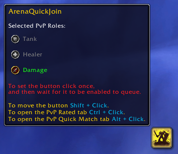

# ArenaQuickJoin

Adds a convenient button that makes joining Arena/RBG matches hassle-free.

## Overview:

This tiny addon tackles a frequent problem associated with macros similar to this `/click ConquestJoinButton`, preventing inadvertent entry into the Solo Shuffle queue or any other rated bracket available by making sure the correct bracket is selected according to group size. It streamlines the Arena/RBG match joining process, thereby improving the overall gaming experience.

**Please note that the button only appears when you're at maximum level.**

## Features:

- **Bindable Button:** The button can be binded by going to Options -> Keybindings -> ArenaQuickJoin.
- **Draggable Button:** Easily move the button around by holding the Shift modifier.
- **Quick Access:** Open the Rated tab by holding the Ctrl modifier and the Quick Match tab by holding the Alt modifier.
- **Combat and Instances:** The button grays out during combat and remains hidden inside instances.
  
## Known Issue:
When you open the group finder while in combat and try to select one of the rated brackets it wouldn't get tracked by the addon due to in-combat restrictions and how the secure environment works so in short it's a Blizzard thing.
